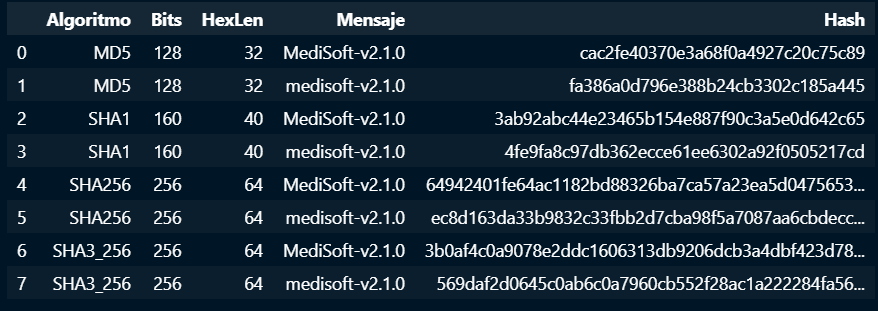
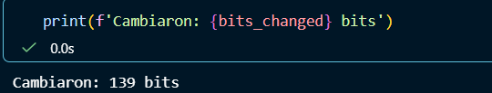
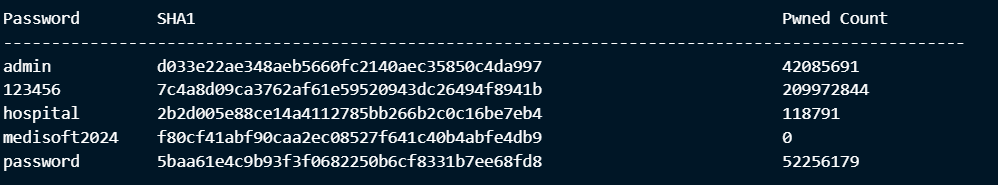
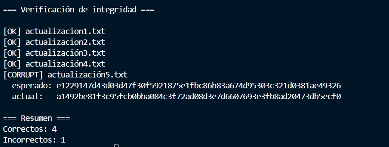
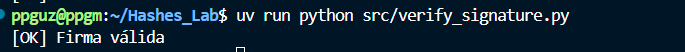
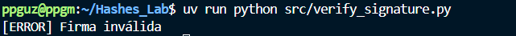
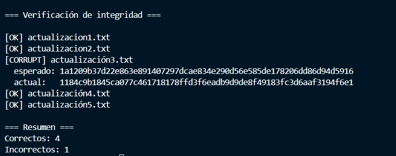

# Laboratorio: hashes

## Ejercicio 1

La implementación de las funciones de hash con distintos algoritmos se encuentra en [explorar_hashes.ipynb](src/explorar_hashes.ipynb)

Los resultados fueron los siguientes:



Para ver los bits que cambiaron, se implemento la siguiente función:

```python
def xor_diff_bits(a: bytes, b: bytes):
    x = strxor(a, b)
    return sum(bin(byte).count("1") for byte in x)
```

Al implementarla con los hashes de los mensajes, se obtuvo que 139 bits cambiaron, esto muestra la propiedad de avalancha, un pequeño cambio genera hashes totalmente diferentes.



MD5 es inseguro porque el hash solo genera 128 bits, es un espacio bastante pequeño y reduce la cantidad de posibles hashes, esto facilita encontrar colisiones. 

## Ejercicio 2

Se implementó en el archivo [api_search.ipynb)](src/api_search.ipynb)

El resultado fue:



Nos indica que solamente la contraseña con el nombre de la empresa no ha sido expuesta varias veces en filtraciones, esto se debe a que, como es un nmbre inventado, nadie nunca ha usado un nombre similar como contraseña y por lo tanto nunca se ha filtrado. 

## Ejercicio 3

Se implementó el generador en: [generar_manifiesto.py](src/generar_manifiesto.py)
El verficador en: [verificar_paquete.py](src/verificar_paquete.py)

Se obtuvo este resultado al alterar el archivo 5:



Para utilizarlo:


- Primero crear los archivos desados en la carpeta files o usar los que ya existen 
- Luego, ejecutar el siguiente comando desde la raíz del proyecto

```bash
uv run python src/generar_manifiesto.py files/actualizacion1.txt files/actualizacion2.txt files/actualización3.txt files/actualización4.txt files/actualización5.txt ... otros archivos
```

- Ahora ejecutar este comando para obtener resultados 

```bash
uv run python src/verificar_paquete.py
```

## Ejercicio 4

La generación de llave y firma se implementó en [firmar.py](src/firmar.py)

Para ejecutarlo, correr este comando desde la raíz

```bash
uv run python src/firmar.py
```

Para verificar la firma, el código se encuentra en este archivo [verify_signature.py](src/verify_signature.py)

Para ejecutarlo, correr este comando desde la raíz

```bash
uv run python src/verify_signature.py
```

Con el archivo original, se obtuvo este resultado:



Cambiando un solo caracter del archivo original, se obtiene: 




Luego, se revirtió el cambio y se cambio un caracter de uno de los archivos de actualización. La firma es válida porque no hemos actualizado la firma generada por el archivo que contiene los hashes originales, tenemos que actualizar el archivo txt si hay cambios y generar una nueva firma.
Al correr la verificación del paquete se obtiene que hay un archivo incorrecto pues el hash no coincide. 

